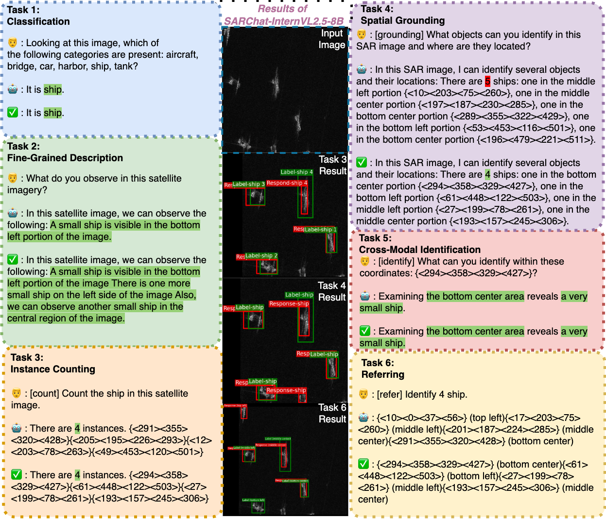

# SARChat

                          

  
  
  
  
  
  

## Introduction

SARChat-Bench-2M is the first large-scale multimodal dialogue dataset focusing on Synthetic Aperture Radar (SAR) imagery. It contains approximately 2 million high-quality SAR image-text pairs, supporting multiple tasks including scene classification, image captioning, visual question answering, and object localization. We conducted comprehensive evaluations on 16 state-of-the-art vision-language models (including Qwen2VL, InternVL2.5, and LLaVA), establishing the first multi-task benchmark in the SAR domain.

📑 Read more about SARChat in our [paper](https://arxiv.org/abs/xxxx.xxxxx).

## Overview & Model Performance

  
   
  <em>Figure 1: Overview of SARChat's architecture (left) and comprehensive evaluation results showing model capabilities across different tasks (right)</em>

## Data Processing Workflow

  
   
  <em>Figure 2: Data processing workflow of SARChat</em>

## Key Features

- 🌟 **2M+** high-quality SAR image-text pairs
- 🔍 Covers diverse scenes including marine, terrestrial and urban areas
- 📊 **6 task-specific benchmarks** with fine-grained annotations
- 🤖 Evaluated on **11 SOTA vision-language models**
- 🛠️ Ready-to-use format with shape, count, location labels

## Dataset Statistics

### Tasks Statistics

  
  
   
  <em>Figure 3: Distribution of tasks in training (left) and test (right) sets</em>

| Task | Train Set | Test Set |
|:---:|:---:|:---:|
| Classification | 81,788 | 10,024 |
| Fine-Grained Description | 46,141 | 6,032 |
| Instance Counting | 95,493 | 11,704 |
| Spatial Grounding | 94,456 | 11,608 |
| Cross-Modal Identification | 1,423,548 | 175,565 |
| Referring | 95,486 | 11,703 |

### Category Analysis

  
  
   
  <em>Figure 4: Category distribution in training (left) and test (right) sets</em>

### Words Statistics

| Metric | Value |
|:---:|:---:|
| Total Words | 43,978,559 |
| Total Sentences | 4,222,143 |
| Average Caption Length | 10.66 |

## Quick Start

🤗 Visit our [Hugging Face dataset page](https://huggingface.co/datasets/YourOrg/SARChat) for more details and examples.

## Results Showcase

  
   
  <em>Figure 6: Example results from SARChat-InternVL2.5-8B model on various SAR vision-language tasks</em>

The above figure demonstrates the capabilities of our SARChat-InternVL2.5-8B model across different tasks. The model shows strong performance in understanding complex SAR imagery, providing detailed descriptions, accurate counting, and precise spatial reasoning. These results highlight the model's ability to bridge the gap between SAR imagery and natural language understanding.

## SARChat Models

We have trained and evaluated several models using the SARChat dataset:

| Organization | Model | Size | Link |
|:---:|:---:|:---:|:---:|
| InternVL | SARChat-InternVL2.5 | 1B | [Link](https://huggingface.co/YourOrg/internvl2.5-1b) |
| InternVL | SARChat-InternVL2.5 | 2B | [Link](https://huggingface.co/YourOrg/internvl2.5-2b) |
| InternVL | SARChat-InternVL2.5 | 4B | [Link](https://huggingface.co/YourOrg/internvl2.5-4b) |
| InternVL | SARChat-InternVL2.5 | 8B | [Link](https://huggingface.co/YourOrg/internvl2.5-8b) |
| QwenVL | SARChat-Qwen2VL | 2B | [Link](https://huggingface.co/YourOrg/qwen2vl-2b) |
| QwenVL | SARChat-Qwen2VL | 7B | [Link](https://huggingface.co/YourOrg/qwen2vl-7b) |
| DeepSeek | SARChat-DeepSeekVL | 1.3B | [Link](https://huggingface.co/YourOrg/deepseekvl-1.3b) |
| DeepSeek | SARChat-DeepSeekVL | 7B | [Link](https://huggingface.co/YourOrg/deepseekvl-7b) |
| mPLUG-Owl | SARChat-Owl3 | 1B | [Link](https://huggingface.co/YourOrg/owl3-1b) |
| mPLUG-Owl | SARChat-Owl3 | 2B | [Link](https://huggingface.co/YourOrg/owl3-2b) |
| mPLUG-Owl | SARChat-Owl3 | 7B | [Link](https://huggingface.co/YourOrg/owl3-7b) |
| Microsoft | SARChat-Phi3V | 4.3B | [Link](https://huggingface.co/YourOrg/phi3v-4.3b) |
| Zhipu AI | SARChat-GLM-Edge | 2B | [Link](https://huggingface.co/YourOrg/glm-edge-2b) |
| Zhipu AI | SARChat-GLM-Edge | 5B | [Link](https://huggingface.co/YourOrg/glm-edge-4b) |
| LLaVA-Team | SARChat-LLaVA-1.5 | 7B | [Link](https://huggingface.co/YourOrg/llava-v1.5-7b) |
| 01.AI | SARChat-Yi-VL | 6B | [Link](https://huggingface.co/YourOrg/yi-vl-7b) |

## Citation

If you use this dataset or our models in your research, please cite our paper.

## Contact

For any questions or feedback, please contact:

- 📧 Email: mazhiming312@outlook.com
- 💬 GitHub Issues: Feel free to open an issue in this repository

## Acknowledgments

We would like to thank:
- [Organization/Individual] for their support in data collection
- [Organization/Individual] for their valuable feedback
- [Computing Infrastructure] for providing computing resources
- All contributors who helped create and improve this dataset

---

  <i>If you find SARChat useful, please consider giving it a star ⭐</i>

